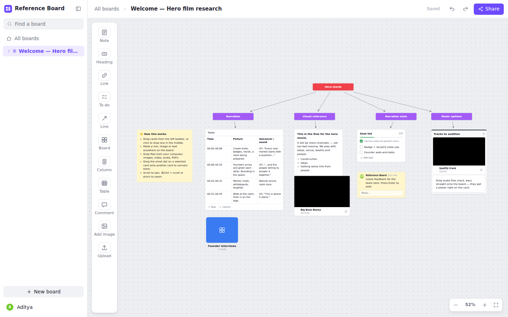

# Reference Board

An internal, Milanote-style visual board for collecting references and structuring research as a team.
Put notes, links, embedded video and music, uploads, tables and to-dos on an infinite canvas,
connect them with lines, group them in columns, and nest boards inside boards. Everyone on a board sees
edits, presence and cursors live.



## What you can put on a board

| Card | What it does |
| --- | --- |
| **Note** | Rich text: bold, italic, headings, lists, links. Click a selected note (or double-click) to edit. |
| **Heading** | Coloured label for structuring sections ("Hero movie" → "Narration", "Music options"…). |
| **Link** | Paste any URL. YouTube, Vimeo, Loom, Spotify, SoundCloud, Apple Music, Figma, Google Docs/Drive and direct media links become **playable embeds**; other sites get a preview card (title, image, description). |
| **To-do** | Checklist with progress. Enter adds a task and Backspace on an empty task removes it. |
| **Table** | Editable grid for scripts, shot lists and comparisons. Add or remove rows and columns. |
| **Comment** | Threaded comments with author and time. |
| **Board** | A nested board. Double-click to open it; breadcrumbs and the sidebar show the hierarchy. |
| **Column** | Drag cards in and out to group and order them. |
| **Image / Video / Audio / File** | Upload via the toolbar, drag files from your desktop, or paste images. Audio gets an inline player, video a native player, and PDFs and other files a download card. |
| **Line** | FigJam-style connector between two cards: elbow, curved or straight, solid or dashed, three thicknesses, any colour, arrows at none/one/both ends, and an optional label. |

## Projects and backgrounds

- **Projects** group boards like folders. The home page shows every project, recently updated boards, and boards without a project. Open a project to see only its boards. Nested boards follow their parent's project.
- Move a board between projects with the **⋯** menu on its tile. Deleting a project keeps its boards; they become unfiled.
- **Board background:** use the palette button in a board's top bar. Dark backgrounds (Graphite, Charcoal, Midnight, Forest) switch that board's cards and tools to dark grey. The choice is saved on the board, so everyone sees it.

## Using it

- **Add cards:** click a toolbar item (it drops in a free spot) or drag it onto the canvas. Double-click empty canvas for a quick note.
- **Paste anything:** a URL makes a link card, an image uploads, and plain text makes a note.
- **Connect:** select a card and drag any of the four dots (top, right, bottom, left) onto another card. Drop near an edge to attach to that side, or near the middle to let the line pick the best side. The **Line** tool (click two cards) also works.
- **Edit a line:** click it to open its toolbar (colour, thickness, text, dash, line type, arrows). Drag the end circles to re-attach them to another card or side. On elbow lines, every segment has a blue handle: the middle one moves the bend, and the end segments slide along their card (or step out past its edge). Double-click a handle to reset it.
- **Select (like Figma):** drag on empty canvas to box-select. Shift-drag or shift-click adds to the selection.
- **Navigate:** hold **Space** and drag, or drag with the **middle mouse button**, to pan. Scrolling with a trackpad or wheel also pans. ⌘/Ctrl + scroll or pinch to zoom. ⇧1 fits the board to the screen.
- **Resize:** drag the square handle at a selected card's bottom-right corner.
- **Copy between boards:** ⌘C / ⌘V copies cards, including the lines between them, into any board.

| Shortcut | Action |
| --- | --- |
| ⌘Z / ⇧⌘Z | Undo / redo |
| Space + drag / middle-drag | Pan |
| ⌘D | Duplicate |
| ⌘A | Select all |
| Delete / Backspace | Delete selection |
| Arrows (⇧ for 10px) | Nudge |
| Enter | Edit selected card |
| N, H, L, T, B, C | New note, heading, link, to-do, board, line |
| ⌘+ / ⌘− / ⌘0 | Zoom in / out / 100% |

## Running it

Requires Node 20+.

```bash
npm install
npm run dev          # API on :3001 + Vite on http://localhost:5173
```

### Demo project

A new install creates two things: a small example board, and **“Demo · Aurora Summit launch campaign”**. The demo is a large, realistic project that uses every feature: a hub board with six nested workstream boards (one nested three levels deep), a team wiki, an archive, every card type, columns, all connector styles and light and dark backgrounds. Uploaded files are generated on the spot: storyboard frames, moodboard artwork, music demos, a PDF call sheet and a CSV budget.

To add it to an existing install, stop the app and run:

```bash
npm run demo        # adds the demo project to ./data (or $DATA_DIR)
npm start
```

Some demo photos and videos load from the web (picsum.photos, YouTube, Vimeo, Spotify), so those cards need an internet connection.

Production (one process serves the app, API, uploads and WebSocket):

```bash
npm run build
npm start            # http://localhost:3001
```

Or with Docker:

```bash
docker build -t reference-board .
docker run -p 3001:3001 -v reference-board-data:/data -e APP_PASSWORD=choose-one reference-board
```

### Configuration

| Env var | Default | |
| --- | --- | --- |
| `PORT` | `3001` | HTTP port |
| `DATA_DIR` | `./data` | Where boards (`boards/*.json`), projects (`projects.json`) and uploads (`uploads/`) are stored. Back up this folder. |
| `APP_PASSWORD` | *(none)* | Shared team password. **Set this for anything reachable beyond your machine.** |
| `MAX_UPLOAD_MB` | `500` | Per-file upload limit |

## How it works

- **Frontend:** React + TypeScript (Vite). The canvas uses DOM cards positioned in a transformed "world" layer, with an SVG layer for lines.
- **Backend:** Express (`server/`). Each board is one JSON file, written atomically. Uploads are stored on disk and served from `/uploads`.
- **Sync:** edits apply locally at once, then a debounced diff sends **only the changed cards** to the server. The server fans that patch out to everyone on the board over WebSocket. Two people editing different cards never overwrite each other. If both edit the *same* card at once, the last write wins. After a dropped connection the client refetches and re-applies anything unsent.
- **Link previews:** the server fetches Open Graph data. It refuses private/internal addresses (including through redirects), so it can't be used to probe your network.
- **Uploads:** HTML/SVG/JS files are served as downloads with a sandbox CSP, so an uploaded file can't run scripts on the app's origin.

## Project layout

```
server/
  index.js      HTTP API, uploads, auth, WebSocket fan-out
  store.js      board + project storage, patch application
  unfurl.js     link previews (SSRF-guarded)
  seed.js       first-run example board
  demo.js       the large demo project (demo-assets.js generates its files; demo-cli.js = npm run demo)
src/
  App.tsx       shell, routing (#/b/<id>), login + name prompt
  useBoard.ts   local-first board state, undo/redo, save + live sync
  lib.ts        embeds, colours, diff/patch helpers
  connectors.ts line routing: sides, elbow/curved/straight paths, arrowheads
  components/
    Canvas.tsx  pan/zoom, drag, columns, lines, clipboard, keyboard
    items/      one component per card type
```

## Known limits / next ideas

- Auth is one shared password, with no per-user accounts or per-board permissions.
- Concurrent edits to the *same* card are last-write-wins. Per-character merging would need a CRDT such as Yjs.
- No freehand drawing or full-text search across card contents yet. The sidebar searches board titles only.
